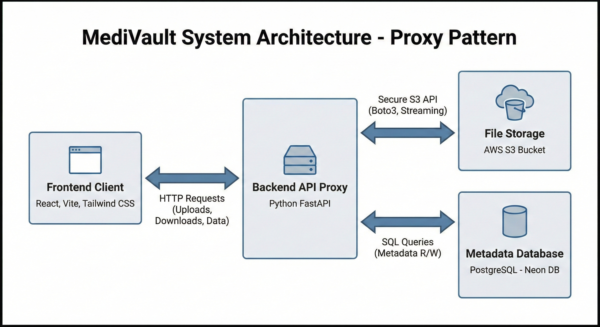

# Design Document: MediVault Patient Portal

## 1. Tech Stack Choices

**Q1. What frontend framework did you use and why?**
* **Choice:** React (Vite + Tailwind CSS)
* **Reasoning:** React's component-based architecture is ideal for managing the state of a dashboard (file lists, upload progress, toast notifications). Vite was chosen for its superior build speed compared to Create-React-App. Tailwind CSS was selected to rapidly build a professional, responsive UI without writing custom stylesheets.

**Q2. What backend framework did you choose and why?**
* **Choice:** Python FastAPI
* **Reasoning:** FastAPI is high-performance and modern. It offers automatic data validation (Pydantic) and auto-generated Swagger documentation, which speeds up development. Crucially, its `StreamingResponse` capabilities allow efficient file proxying between S3 and the client.

**Q3. What database did you choose and why?**
* **Choice:** PostgreSQL (Neon DB)
* **Reasoning:** While SQLite is good for local testing, the assignment asked for a solution that could scale. PostgreSQL is the industry standard for production relational data. Neon DB provides a serverless PostgreSQL instance that mimics a real-world cloud environment better than a local file-based DB.

**Q4. If you were to support 1,000 users, what changes would you consider?**
1.  **Authentication:** Implement OAuth2/JWT (e.g., Auth0) to securely separate user data.
2.  **CDN:** Serve the static frontend and cached documents via a CDN (Cloudflare) to reduce latency.
3.  **Database Indexing:** Add indexes on the `created_at` and `filename` columns to speed up search queries as the dataset grows.
4.  **Async Processing:** Move file uploads to a background worker (Celery/Redis) if file sizes increase significantly, to prevent blocking the main API thread.

---

## 2. Architecture Overview

**Flow:**

1.  **Frontend:** Handles user interactions (Drag & Drop, Search). It never talks to the Database or S3 directly.
2.  **Backend (The Proxy):** Acts as the secure gatekeeper.
    * **Uploads:** Receives the file stream -> Validates PDF -> Streams to S3 -> Saves metadata to DB.
    * **Downloads:** Fetches the file stream from S3 -> Streams it back to the Client. This avoids CORS issues and exposure of S3 buckets to the public internet.
3.  **Storage:**
    * **PostgreSQL:** Stores file metadata (`id`, `filename`, `size`, `s3_key`, `created_at`).
    * **AWS S3:** Stores the actual PDF blobs securely.

---

## 3. API Specification

| Endpoint | Method | Description | Params/Body |
| :--- | :--- | :--- | :--- |
| `/documents/upload` | `POST` | Upload a PDF file | `file`: binary (multipart/form-data) |
| `/documents` | `GET` | List all uploaded files | None |
| `/documents/{id}` | `GET` | Stream file content | Query: `?download=true` (forces save) or `false` (view) |
| `/documents/{id}` | `DELETE` | Delete a file | None |

---

## 4. Data Flow Description

**Q5. Step-by-step process:**

**When a file is uploaded:**
1.  User drops a PDF in the React UI.
2.  React sends a `POST` request with the file blob to FastAPI.
3.  FastAPI validates the `application/pdf` MIME type.
4.  FastAPI calculates the file size by seeking the stream end.
5.  FastAPI streams the binary data directly to AWS S3 using `boto3`.
6.  Upon S3 success, FastAPI inserts a row into PostgreSQL.
7.  The updated list is returned to the UI.

**When a file is downloaded:**
1.  User clicks "Open" or "Download" in the UI.
2.  React requests `/documents/{id}` (adding `?download=true` if "Download" was clicked).
3.  FastAPI queries PostgreSQL to find the S3 Key.
4.  FastAPI opens a secure stream to S3 using private credentials.
5.  FastAPI pipes this stream directly to the client response, setting the correct `Content-Disposition` header so the browser knows whether to save it or show it.

---

## 5. Assumptions

**Q6. Assumptions made:**
1. **Single User Environment:** As per instructions, no login system is implemented. 
2.  **File Size:** Assumed a reasonable limit (e.g., 10MB) for performance, though S3 supports much larger files.
3.  **Network:** Assumed the host machine has internet access to reach Neon DB and AWS S3.